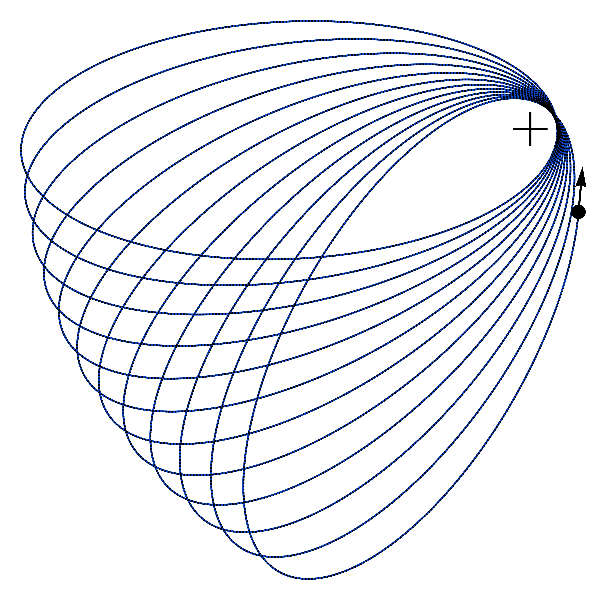

# QK Orbits

Tools for conservative PN quasi-Keplerian (QK) orbits and direct polar-EOM evolution for aligned-spin compact binaries.



<p align="center"><sub>(input: <code>En=-1/2000</code>, <code>L=14</code>, <code>eps=1</code>, <code>nu=1/4</code>, <code>delta=0</code>, <code>chiS=1</code>, <code>chiA=0</code>, <code>kappaS=0</code>, <code>kappaA=0</code>, <code>SO=1</code>; QK parameters: <code>n=0.00003156045359033833</code>, <code>K=1.0146059311639184</code>, <code>a_r=998.4872255108467</code>, <code>e_r=0.8993053072175136</code>, <code>e_t=0.8961268723821495</code>, <code>e_phi=0.899420582549924</code>, <code>f_phi=0.000015046180398609838</code>, <code>g_phi=6.009778722053774e-8</code>, <code>h_phi=7.678475281627262e-9</code>, <code>i_phi=0</code>, <code>g_t=0.00001363334233196573</code>, <code>f_t=5.877786734211771e-7</code>, <code>h_t=-1.5045981436324583e-8</code>, <code>i_t=0</code>)</sub></p>


The two public orbit generators have the same practical input shape:

```text
primitive binary parameters
initial data {r, phi, rdot, phidot}
times
PNOrder
```

The orbit generators return

```text
t, r, phi, rdot, phidot
```

## Included Models

```text
Bound3PNAlignedSpin      bound conservative QK orbit
Unbound3PNAlignedSpin    hyperbolic conservative QK orbit
Parabolic3PNAlignedSpin  quasi-parabolic conservative QK orbit
```

All three models use the same aligned-spin conservative content through 3PN: nonspinning 0PN--3PN, spin-orbit 1.5PN and 2.5PN, and spin-spin 2PN and 3PN.

## Quick Start

```wl
Get["src/QKOrbits.wl"];
Get["src/DirectEOMOrbits.wl"];

model = QKLoadModel["Unbound3PNAlignedSpin"];
eom = DirectEOMLoad[];

primitiveParams = <|
  "eps" -> 1,
  "nu" -> 21/100,
  "delta" -> 2/5,
  "chi1" -> 1,
  "chi2" -> 1,
  "kap1" -> 1,
  "kap2" -> 1
|>;

initialData = <|
  "r" -> 40,
  "phi" -> 1/5,
  "rdot" -> 0.04,
  "phidot" -> 0.007
|>;

times = N[Subdivide[0, 70, 160], 40];

qkInfo = QKParameterValuesFromInitialData[model, primitiveParams,
  initialData, "PNOrder" -> 3];

qk = QKOrbitFromInitialData[model, primitiveParams, initialData, times,
  "PNOrder" -> 3];

direct = DirectEOMOrbit[eom, primitiveParams, initialData, times,
  "PNOrder" -> 3];
```

`qkInfo` contains the conservative labels and QK parameters fixed by the initial state:

```wl
qkInfo["ConservedLabels"]
(* <|"En" -> ..., "L" -> ...|> *)

qkInfo["InitialScales"]
(* <|"vSquared" -> ..., "oneOverR" -> ...|> *)

qkInfo["QKParameters"]
(* <|"n" -> ..., "K" -> ..., "ar" -> ..., ...|> *)
```

For the parabolic QK model, do not tune a four-field initial state by hand. Supply $r,\phi$, and exactly one velocity component.  For example, this solves $\dot r$ from $E_n=0$:

```wl
parabolicInput = <|
  "r" -> 25,
  "phi" -> 1/4,
  "phidot" -> 0.006
|>;

parabolicInfo = QKParameterValuesFromInitialData[
  QKLoadModel["Parabolic3PNAlignedSpin"],
  primitiveParams, parabolicInput, "PNOrder" -> 3,
  "ParabolicVelocitySign" -> 1];

parabolicInfo["InitialData"]
(* completed {r, phi, rdot, phidot} *)
```

Use `"ParabolicVelocitySign" -> -1` for the opposite missing-velocity branch: incoming radial motion when solving $\dot r$, or retrograde angular motion when solving $\dot\phi$.  If no real missing velocity with the requested sign solves $E_n=0$, the parabolic setup returns `$Failed` with an error message.

Allowed PN truncations are exactly

```wl
QKAllowedPNOrders[]
DirectEOMAllowedPNOrders[]

(* {0, 1, 1.5, 2, 2.5, 3} *)
```

`PNOrder` is the truncation switch.  `eps` is separate: it is the PN bookkeeping parameter appearing in the formulas,

$$
0{\rm PN}\sim \epsilon^0,\quad
1{\rm PN}\sim \epsilon^2,\quad
1.5{\rm PN}\sim \epsilon^3,\quad
2{\rm PN}\sim \epsilon^4,\quad
2.5{\rm PN}\sim \epsilon^5,\quad
3{\rm PN}\sim \epsilon^6 .
$$

Use `eps -> 1` for the physical PN series.  This is the default used by the examples.  Smaller values are bookkeeping diagnostics only; do not use them for a physical orbit.

## Scope

Units:

$$G=c=M=1,\qquad M=m_1+m_2.$$

The relative variables are

$$
r=|\vec{x}_1-\vec{x}_2|,\qquad
\phi=\arg(\vec{x}_1-\vec{x}_2),
$$

with returned velocities

$$
\dot r=\frac{dr}{dt},\qquad
\dot\phi=\frac{d\phi}{dt}.
$$

All public orbit generators use the corresponding dimensionless variables:

$$
t_{\rm code}=\frac{c^3t_{\rm phys}}{GM}=\frac{t_{\rm phys}}{M},
\qquad
r_{\rm code}=\frac{c^2r_{\rm phys}}{GM}=\frac{r_{\rm phys}}{M}.
$$

Thus the plot axes are labelled as $t/M$ and $r/M$.  The angle $\phi$ is dimensionless, $\dot r=dr_{\rm code}/dt_{\rm code}$, and the returned angular velocity is

$$
\dot\phi_{\rm code}=\frac{d\phi}{dt_{\rm code}}
=M\frac{d\phi}{dt_{\rm phys}} .
$$

Accordingly the angular-velocity plot label is $M\dot\phi$.

The mass parameters are

$$
\nu=\frac{m_1m_2}{M^2},\qquad
\delta=\frac{m_1-m_2}{M},\qquad
\delta^2=1-4\nu .
$$

Aligned spins are specified by

$$
\chi_1,\quad \chi_2,\quad \kappa_1,\quad \kappa_2 ,
$$

where $\chi_A$ are dimensionless spins and $\kappa_A$ are spin-induced quadrupole parameters.  Internally the QK formulas use

$$
\chi_S=\frac{\chi_1+\chi_2}{2},\qquad
\chi_A=\frac{\chi_1-\chi_2}{2},
$$

and

$$
\kappa_S=\frac{(\kappa_1-1)\chi_1^2+(\kappa_2-1)\chi_2^2}{2},\qquad
\kappa_A=\frac{(\kappa_1-1)\chi_1^2-(\kappa_2-1)\chi_2^2}{2}.
$$

The implemented conservative content is

```text
nonspinning: 0PN, 1PN, 2PN, 3PN
spin-orbit: 1.5PN, 2.5PN
spin-spin:  2PN, 3PN
```

## Gauge Choices

These are coordinate-gauge dependent PN formulas, not gauge-invariant observables by themselves.  The implemented nonspinning 3PN sector is in modified harmonic coordinates.  The spin-orbit and spin-spin sectors are taken from harmonic-coordinate aligned-spin equations of motion, after reduction to the PN center-of-mass frame and to polar relative variables $(r,\phi,\dot r,\dot\phi)$.

The spin terms use aligned spins represented by conserved Euclidean-norm spin vectors.  In the source harmonic-gauge spin calculations these vectors are constructed from a spin tensor satisfying the covariant, or Tulczyjew, spin supplementary condition $S^{\mu\nu}p_\nu=0$, where $p_\nu$ is the particle four-momentum.

## QK Form

The QK representation rewrites the conservative orbit using an anomaly variable.  The anomaly solves a Kepler-like time equation, while $r$ and $\phi$ are explicit functions of that anomaly. This construction goes back to the 1PN quasi-Keplerian solution of Damour and Deruelle.  Later generalized QK parametrizations extended the same idea to higher PN order and to the multiple-eccentricity structure used below.

For bound orbits:

$$
n(t-t_0)
  =u-e_t\sin u
   +g_t(v-u)+f_t\sin v+h_t\sin 2v+i_t\sin 3v ,
$$

$$
r=a_r(1-e_r\cos u),
$$

$$
\phi-\phi_0
  =K\left[v+f_\phi\sin 2v+g_\phi\sin 3v
            +h_\phi\sin 4v+i_\phi\sin 5v\right],
$$

with

$$
v=2\arctan\left[
\sqrt{\frac{1+e_\phi}{1-e_\phi}}\tan\frac{u}{2}
\right].
$$

For hyperbolic unbound orbits:

$$
n(t-t_0)
  =e_t\sinh u-u
   +g_t v+f_t\sin v+h_t\sin 2v+i_t\sin 3v ,
$$

$$
r=a_r(e_r\cosh u-1),
$$

$$
\phi-\phi_0
  =K\left[v+f_\phi\sin 2v+g_\phi\sin 3v
            +h_\phi\sin 4v+i_\phi\sin 5v\right],
$$

with

$$
v=2\arctan\left[
\sqrt{\frac{e_\phi+1}{e_\phi-1}}\tanh\frac{u}{2}
\right].
$$

For parabolic orbits the natural variable is Barker's variable $w$:

$$
r=r(w),\qquad t-t_0=t(w),\qquad \phi-\phi_0=\phi(w),
$$

with Newtonian limit

$$
r=\frac{L^2}{2}(1+w^2),\qquad
t-t_0=\frac{L^3}{2}\left(w+\frac{w^3}{3}\right),\qquad
\phi-\phi_0=2\arctan w .
$$

The QK parameters are

$$
a_r,e_r,e_t,e_\phi,n,K,
g_t,f_t,h_t,i_t,f_\phi,g_\phi,h_\phi,i_\phi .
$$

They are not independent inputs.  They are PN series determined by the conserved orbital labels and binary parameters,

$$
X_{\rm QK}
  =X_{\rm QK}(E_n,L,\nu,\delta,\chi_S,\chi_A,\kappa_S,\kappa_A).
$$

At Newtonian order,

$$
e_r=e_t=e_\phi=\sqrt{1+2E_nL^2},\qquad
n=(2|E_n|)^{3/2},
$$

and

$$
a_r=-\frac{1}{2E_n}\quad(E_n<0),\qquad
a_r=\frac{1}{2E_n}\quad(E_n>0).
$$

The high-level function `QKParameterValuesFromInitialData` evaluates the conserved energy and angular momentum from the supplied $(r,\phi,\dot r,\dot\phi)$ using the retained 3PN aligned-spin conserved quantities, then evaluates the QK parameters in the same PN truncation:

```wl
qkInfo = QKParameterValuesFromInitialData[model, primitiveParams,
  initialData, "PNOrder" -> 3]
```

The returned association has

```text
InitialData      -> completed {r,phi,rdot,phidot}
InitialScales    -> {|v|^2,1/r} at the completed initial state
ConservedLabels  -> {En,L}
OrbitParameters  -> labels plus the QK spin combinations used internally
QKParameters     -> QK elements with labels and binary parameters inserted
```

`QKOrbitFromInitialData` uses the same construction internally and returns only the trajectory.  If the labels alone are needed:

```wl
labels = QKLabelsFromInitialData[primitiveParams, initialData,
  "PNOrder" -> 3]
```

For a parabolic QK orbit the high-level interface enforces the marginally bound surface $E_n=0$.  Provide $r,\phi$, and exactly one of $\dot r,\dot\phi$; the missing velocity is solved from $E_n=0$.  The option `"ParabolicVelocitySign" -> 1|-1` selects the sign of the missing component. The completed four-field initial state is returned as `qkInfo["InitialData"]` and should be used when launching a direct-EOM comparison.

For a bound QK orbit the completed initial state must give $E_n<0$ at the requested `PNOrder`; otherwise the high-level setup returns `$Failed`.

## Direct EOM

The direct numerical generator integrates the explicit second-order polar equations

$$
\frac{dr}{dt}=\dot r,\qquad
\frac{d\phi}{dt}=\dot\phi,
$$

$$
\frac{d\dot r}{dt}=\ddot r_{\rm PN}(r,\dot r,\dot\phi),\qquad
\frac{d\dot\phi}{dt}=\ddot\phi_{\rm PN}(r,\dot r,\dot\phi).
$$

Internally,

$$
s=\frac{1}{r},\qquad v_t=r\dot\phi=\frac{\dot\phi}{s},\qquad
v^2=\dot r^2+v_t^2 .
$$

The direct integrator can optionally add the leading nonspinning 2.5PN radiation-reaction acceleration:

```wl
"Include2p5PNRadiationReaction" -> True
```

This option is off by default.  With it enabled, the direct EOM is dissipative and is not expected to coincide with the conservative QK trajectory.

For speed, `DirectEOMOrbit` defaults to machine precision, automatic accuracy goals, automatic method choice, and automatic step size.  The earlier high-precision validation settings

```wl
WorkingPrecision -> 40,
AccuracyGoal -> 20,
PrecisionGoal -> 20,
MaxStepSize -> 1/2
```

are intentionally not the interactive defaults; they are useful for regression checks, but they make the numerical orbit generator much slower.

The implemented harmonic-gauge terms are

$$
A_{2.5{\rm PN}}=\epsilon^5\frac{8\nu}{5}s\dot r
\left(\frac{17}{3}s-3v^2\right),
$$

$$
B_{2.5{\rm PN}}=\epsilon^5\frac{8\nu}{5}s(3s+v^2),
$$

$$
\ddot r_{\rm RR}=-s^2(A_{2.5{\rm PN}}+B_{2.5{\rm PN}}\dot r),
\qquad
\ddot\phi_{\rm RR}=-s^3B_{2.5{\rm PN}}v_t .
$$

## Bound-Unbound Mapping

One structural check used in this project is the relation between the bound and hyperbolic QK forms.  In the same coordinate convention, after imposing

$$
\delta^2=1-4\nu ,
$$

the retained aligned-spin radial and angular sectors obey direct analytic continuation:

$$
a_r^{\rm hyp}=-(a_r^{\rm bound})^{\rm cont},\qquad
e_r^{\rm hyp}=(e_r^{\rm bound})^{\rm cont},
$$

$$
K^{\rm hyp}=K^{\rm bound,cont},\qquad
e_\phi^{\rm hyp}=e_\phi^{\rm bound,cont}.
$$

The angular harmonic coefficients continue in the same way after the usual bound/hyperbolic anomaly relabeling.

The time sector needs a zero-mode normalization step.  Direct continuation of the bound time equation naturally gives a hyperbolic basis containing

$$
F_{vu}(v-u)+F_v\sin v .
$$

The standard hyperbolic basis used here instead writes

$$
g_t v+f_t\sin v .
$$

At Newtonian hyperbolic order,

$$
q=\sqrt{1+2E_nL^2},\qquad n_0=(2E_n)^{3/2},
$$

so

$$
n_0(t-t_0)=q\sinh u-u .
$$

Then

$$
F_{vu}(v-u)
 =F_{vu}v-qF_{vu}\sinh u+n_0F_{vu}(t-t_0).
$$

Moving the last term to the left-hand side gives the standard hyperbolic normalization shift

$$
n_{\rm std}=n_{vu}-n_0F_{vu},\qquad
e_{t,{\rm std}}=e_{t,vu}-qF_{vu},
$$

$$
g_t=F_{vu},\qquad f_t=F_v .
$$

Thus $F_{vu}$ and $F_v$ continue directly, while $n$ and $e_t$ do not continue label by label.  In the pure nonspinning 3PN normalization this same projection can be written as

$$
n_{\rm std}=(1-F_{vu})n_{vu},\qquad
e_{t,{\rm std}}^2=(1-F_{vu})^2e_{t,vu}^2 .
$$

## Boundary-To-Bound Check

Boundary-to-bound, or B2B, relates gauge-invariant scattering data for hyperbolic motion to gauge-invariant observables of bound motion.  The check included here is only the angular/periastron part of that dictionary.  It does not test the radial-action or time/frequency sectors.

To avoid notation clashes, this section writes the scattering angle as $\chi_{\rm scat}$.  The spin variables remain $\chi_S$ and $\chi_A$.  The symbols used below are:

```text
E_n          conserved reduced energy label used by the QK models
L            public conserved angular-momentum label used by the QK models
j=1/L        signed large-angular-momentum expansion variable used in the check
K            QK periastron-advance factor
e_phi        QK angular eccentricity
v_infty      hyperbolic angular anomaly at infinity
f_phi, ...   QK angular harmonic coefficients
```

The B2B relation being checked is

$$
\Delta\Phi(E,J)=\chi_{\rm scat}(E,J)+\chi_{\rm scat}(E,-J),
$$

where $\Delta\Phi$ is the periastron excess.  In the QK notation this bound-side invariant is

$$
\Delta\Phi_{\rm bound}=2\pi(K_{\rm bound}-1),
$$

and the hyperbolic scattering angle is computed from the unbound angular QK form as

$$
\chi_{\rm scat}=2K_{\rm hyp}\left[v_\infty+f_\phi\sin(2v_\infty)+g_\phi\sin(3v_\infty)+h_\phi\sin(4v_\infty)+i_\phi\sin(5v_\infty)\right]-\pi .
$$

For the retained aligned-spin model, the signed B2B continuation used by the example is

$$
j\to -j,\qquad
\chi_A\to-\chi_A,\qquad
\chi_S\to-\chi_S,\qquad
\delta^2=1-4\nu .
$$

The explicit residual verified by `examples/b2b_aligned_spin_3pn.wls` is

$$
{\cal R}_{\rm B2B}
=\chi_{\rm scat}(E_n,j,\chi_A,\chi_S)
 +\chi_{\rm scat}(E_n,-j,-\chi_A,-\chi_S)
 -2\pi(K_{\rm bound}-1)=0
$$

through the implemented conservative content: nonspinning 0PN--3PN, spin-orbit 1.5PN and 2.5PN, and spin-spin 2PN and 3PN.  Algebraically, the script proves this by checking

```text
K_bound - K_unbound = 0 after delta^2 = 1 - 4 nu,
K, fPhi, hPhi are signed-even,
gPhi, iPhi are signed-odd,
j^2 ePhi^2 is signed-even,
```

where "signed" means the simultaneous transformation $(j,\chi_A,\chi_S)\to(-j,-\chi_A,-\chi_S)$.  The last condition fixes the infinity branch as $v_\infty=\pi/2+\text{signed-odd terms}$.  Therefore the nonconstant angular pieces cancel in the signed sum, and the remaining invariant is exactly $2\pi(K_{\rm bound}-1)$.  This is a check in the model's QK label convention; comparison with the spin B2B literature additionally requires using the same canonical-total-$J$ convention for the angular-momentum label.

## Examples

Command-line examples:

```powershell
wolframscript -script .\qk-orbits-release\examples\minimal_unbound.wls
wolframscript -script .\qk-orbits-release\examples\minimal_parabolic.wls
wolframscript -script .\qk-orbits-release\examples\b2b_aligned_spin_3pn.wls
wolframscript -script .\qk-orbits-release\examples\qk_vs_direct_three_orbits.wls
```

Editable notebook:

```text
qk-orbits-release/examples/qk_vs_direct_three_orbits.nb
```

In the notebook:

```text
Global Inputs:
  pnOrder, includeRR25, parabolicVelocitySign, primitiveParams,
  QK precision settings, directWP, directAccGoal, directPrecGoal,
  directMaxStepSize

Each orbit section:
  bound/unbound inputData = {r, phi, rdot, phidot}
  parabolic inputData = {r, phi, phidot} or {r, phi, rdot}
  times = Subdivide[tStart, tEnd, samples]
  QK parameter/label calculation cell
  QK calculation cell
  direct-EOM calculation cell
  QK-only, direct-only, and overlay plots
```

The plotting helper accepts any association of orbit datasets, for example

```wl
plotOrbit["unbound QK only", <|"QK" -> unboundQK|>]
plotOrbit["unbound direct only", <|"direct EOM" -> unboundDirect|>]
plotOrbit["unbound", <|"direct EOM" -> unboundDirect,
  "QK" -> unboundQK|>]
```

In all example plots the red curve labelled `0PN QK` is the Newtonian QK trajectory generated from the same initial data.  It is a visual baseline, not a separate numerical integration.  In overlay plots the direct-EOM curve is drawn first and the black dashed QK curve second, so the QK line remains visible on top.

The editable notebook displays the full `QKParameters` association returned by `QKParameterValuesFromInitialData`.  The command-line example writes the same full association to each `*_qk_parameters.wl` file.

Regression tests:

```powershell
wolframscript -script .\qk-orbits-release\tests\test_smoke.wls
wolframscript -script .\qk-orbits-release\tests\test_pn_order.wls
wolframscript -script .\qk-orbits-release\tests\test_direct_eom.wls
```

## References

- T. Damour and N. Deruelle, "General relativistic celestial mechanics of binary systems. I. The post-newtonian motion", [Numdam](https://www.numdam.org/item/AIHPA_1985__43_1_107_0/).
- T. Damour and N. Deruelle, "General relativistic celestial mechanics of binary systems. II. The post-newtonian timing formula", [Numdam](https://www.numdam.org/item/AIHPA_1986__44_3_263_0/).
- G. Kälin and R. A. Porto, "From Boundary Data to Bound States", [arXiv:1910.03008](https://arxiv.org/abs/1910.03008).
- G. Kälin and R. A. Porto, "From Boundary Data to Bound States II: Scattering Angle to Dynamical Invariants (with Twist)", [arXiv:1911.09130](https://arxiv.org/abs/1911.09130).
- L. Blanchet and B. R. Iyer, "Third post-Newtonian dynamics of compact binaries: equations of motion in the center-of-mass frame", [arXiv:gr-qc/0209089](https://arxiv.org/abs/gr-qc/0209089).
- R.-M. Memmesheimer, A. Gopakumar, and G. Schaefer, "Third post-Newtonian accurate generalized quasi-Keplerian parametrization for compact binaries in eccentric orbits", [arXiv:gr-qc/0407049](https://arxiv.org/abs/gr-qc/0407049).
- S. Marsat, A. Bohe, G. Faye, and L. Blanchet, "Next-to-next-to-leading order spin-orbit effects in the equations of motion of compact binary systems", [arXiv:1210.4143](https://arxiv.org/abs/1210.4143).
- A. Bohe, S. Marsat, G. Faye, and L. Blanchet, "Next-to-next-to-leading order spin-orbit effects in the near-zone metric and precession equations of compact binaries", [arXiv:1212.5520](https://arxiv.org/abs/1212.5520).
- L. Blanchet, G. Faye, S. Marsat, and E. K. Porter, "Quadratic-in-spin effects in the orbital dynamics and gravitational-wave energy flux of compact binaries at the 3PN order", [arXiv:1501.01529](https://arxiv.org/abs/1501.01529).
- Q. Henry and M. Khalil, "Spin effects in gravitational waveforms and fluxes for binaries on eccentric orbits to the third post-Newtonian order", [arXiv:2308.13606](https://arxiv.org/abs/2308.13606).
